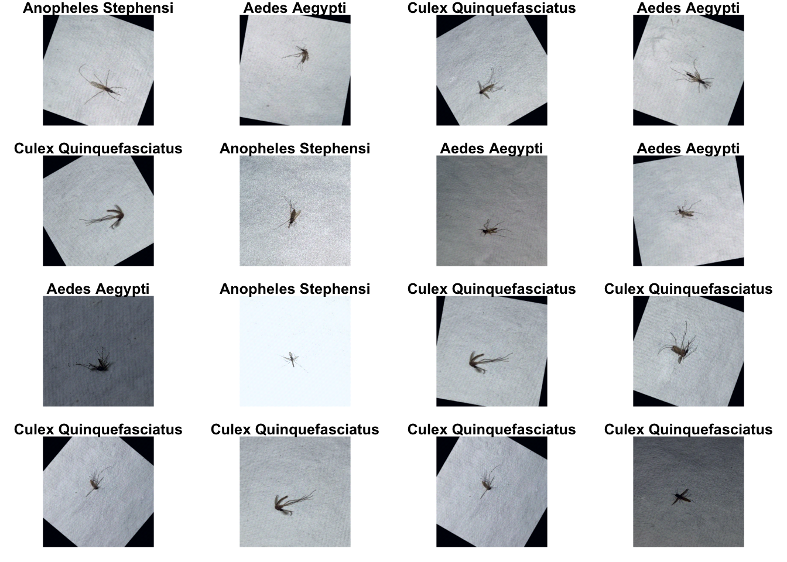
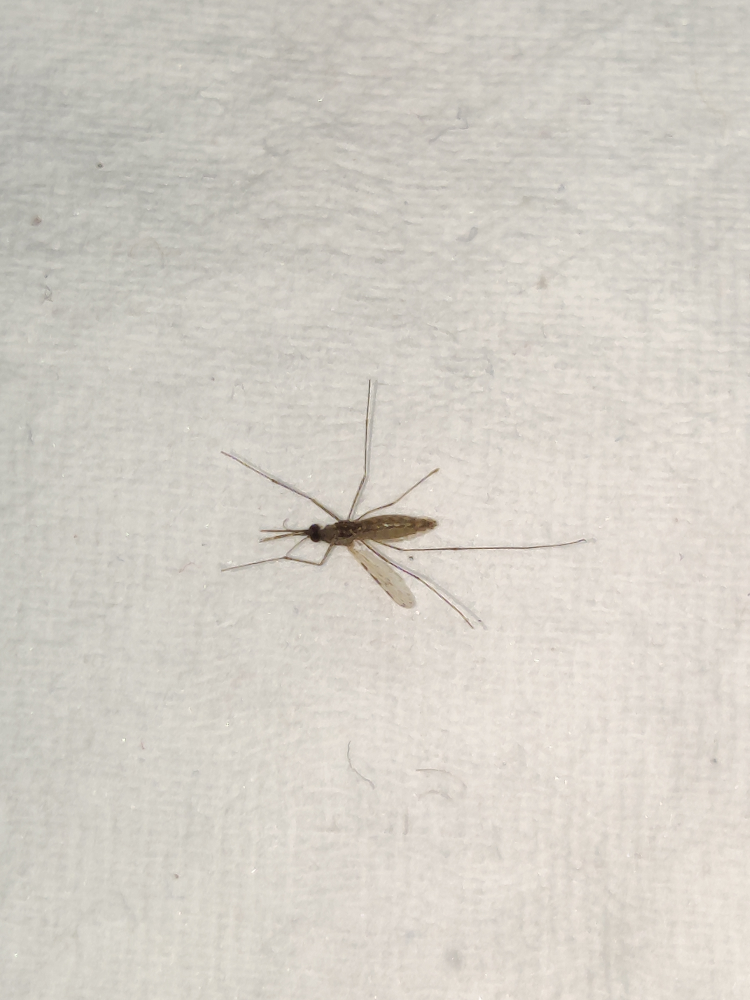

In this tutorial, we will build an image classification Deep Learning model using the `torch` R package. The dataset for this tutorial is the [Dataset of Vector Mosquito Images](https://data.mendeley.com/datasets/88s6fvgg2p/4) published by Pise and contributors in Mendeley Data (DOI:10.17632/88s6fvgg2p.4). We downloaded the [`Mosquito Images Augmented.zip`](https://data.mendeley.com/datasets/88s6fvgg2p/4/files/aa5e5905-de51-42ab-9d57-f2422468d3d2) for the purposes of this tutorial.

By the end of this tutorial, you should be able to:
- load and preprocess your own images into `torch` tensors
- import a prebuilt Artificial Neural Network architecture
- fit an Artificial Neural Network model to your data
- evaluate a deep learning model and
- draw inference on a new image (predict a mosquito specie from an image)


This tutorial is inspired by the [Classifying images with torch](https://blogs.rstudio.com/ai/posts/2020-10-19-torch-image-classification/) tutorial by Sigrid Keydana.


We first load the `tidyverse` package, then load the `torch`, `torchvision`, and `luz` packages which are all part of the [`mlverse`](https://github.com/mlverse), a collection of open source libraries to scale Data Science.

All packages are published on the Comprehensive R Archive Network (CRAN) and can therefore be installed with the `install.packages()` function provided by base R.

```r
library(tidyverse)
library(torch)
library(torchvision)
library(luz)
```

Let's set a seed for R and `torch` for reproducible results:
```r
set.seed(1234)
torch_manual_seed(1234)
```


# Unzipping the images
After moving the `Mosquito Images Augmented.zip` archive to our working directory, we unzip the image files into a folder named `mosquitospecies` as follows:

```r
unzip("Mosquito Images Augmented.zip", exdir = "mosquitospecies")
```

```r
root_dir <- file.path(getwd(), "mosquitospecies")
```


Let's identify and clean out corrupt image files.

```r
deleted_files <- 0
for(path in list.files(root_dir, recursive = TRUE, full.names = TRUE)){
  img <- try(jpeg::readJPEG(path), silent = TRUE)
  if(any(class(img) == "try-error")){
    print(path)
    file.remove(path)
    deleted_files <- deleted_files + 1
  }
}
cli::cli_alert(
  paste(deleted_files, "corrupt files have been identified and deleted.")
)
```


# Data Loading and preprocessing

We check for GPU acceleration and use it whenever available.
```r
# Check for GPU accelaration
device <- if (cuda_is_available()) torch_device("cuda:0") else "cpu"
```

## Image Preprocessing
On the training set, most of the preprocessing involves image standardization, augmenting the data by adding noise, and normalization to comply with the [ResNet](https://www.geeksforgeeks.org/residual-networks-resnet-deep-learning/) Artificial Neural Network architecture (often used for image classification) which we use in this tutorial.

```r
# Define Image transformation helper function
train_transform <- function(img) {
  img %>%
    transform_to_tensor() %>%
    (function(x) x$to(device = device)) %>%
    transform_color_jitter() %>%
    transform_random_horizontal_flip() %>%
    transform_normalize(
      mean = c(0.485, 0.456, 0.406), 
      std = c(0.229, 0.224, 0.225)
    )
}
```

For the validation and test sets, no noise was introduced in the data. Images are resized, and normalized accordingly.
```r

test_transform <- valid_transform <- function(img) {
  img %>%
    transform_to_tensor() %>%
    (function(x) x$to(device = device)) %>%
    transform_normalize(
      mean = c(0.485, 0.456, 0.406), 
      std = c(0.229, 0.224, 0.225)
    )
}
```

To import and generate the image dataset for `torch`, we create the `mosquitospecies_dataset` utility which inherits from the `torchvision::image_folder_dataset` dataset utility generator.

```r
# Define Cats and Dogs dataset model
mosquitospecies_dataset <- dataset(
  "mosquitospecies_folder",
  inherit = torchvision::image_folder_dataset,
  initialize = function(root, indices, transform=NULL, target_transform=NULL,
                        loader=NULL, is_valid_file=NULL) {
    super$initialize(root, transform=transform,
                     target_transform=target_transform, loader = loader,
                     is_valid_file=is_valid_file)
    self$indices <- indices
  },
  .getitem = function(index) {
    
    path <- self$samples[[1]][self$indices[index]]
    target <- self$samples[[2]][self$indices[index]]
    
    sample <- self$loader(path)
    
    if (!is.null(self$transform))
      sample <- self$transform(sample)
    
    if (!is.null(self$target_transform))
      target <- self$target_transform(target)
    
    list(x = sample, y = target)
  },
  .length = function() {
    length(self$indices)
  }
)
```

Now, let's randomly split the data into training (70\%), validation (20\%), and test (10\%) sets:

```r
num_imgs <- length(list.files(root_dir, recursive = TRUE))
train_indices <- sample(1:num_imgs, num_imgs * 0.7)
valid_indices <- sample(setdiff(1:num_imgs, train_indices), num_imgs*0.2)
test_indices <- setdiff(setdiff(1:num_imgs, train_indices), valid_indices)
```

Now, we use the dataset generator utility to create the training set and the validation set.
```r
train_ds <- mosquitospecies_dataset(root_dir, train_indices, transform = train_transform)
train_ds$.length()
#> [1] 1847

valid_ds <- mosquitospecies_dataset(root_dir, valid_indices, transform = valid_transform)
valid_ds$.length()
#> [1] 528

test_ds <- mosquitospecies_dataset(root_dir, test_indices, transform = test_transform)
test_ds$.length()
#> [1] 265
```

The generated datasets contain 1847, 528 and 265 images data respectively for the training, validation and test sets.

Let's check whether each set contains the same number of classes:

```r
length(train_ds$classes)
length(valid_ds$classes)
length(test_ds$classes)
class_names <- test_ds$classes

cli::cli_alert(paste0(length(class_names), " classes identified. Classes are: ", paste(class_names, collapse = ", "),"."))
```

Good news, our classes are equally represented in the training, validation and training sets.

## Data Loader
We create a dataloader for each set with a batch size of 16 images.

```r
batch_size <- 16

train_dl <- dataloader(train_ds, batch_size = batch_size, shuffle = TRUE)
valid_dl <- dataloader(valid_ds, batch_size = batch_size)
test_dl <- dataloader(test_ds, batch_size = batch_size)
```

Let's check the number of batches in each loader:

```r
train_dl$.length() 
#> [1] 116

valid_dl$.length() 
#> [1] 33

test_dl$.length()  
#> [1] 17 
```


## Visualizing the data

Here, we visualize the 16 images in the first batch of the training set.

```r
b <- train_dl$.iter()$.next() # take one batch in the training set
targets <- b$y

images <- b$x %>% 
  as_array() %>% 
  aperm(perm = c(1, 3, 4, 2))

mean <- c(0.485, 0.456, 0.406)
std <- c(0.229, 0.224, 0.225)
images <- std * images + mean
images <- images * 255
images[images > 255] <- 255
images[images < 0] <- 0

par(mfcol = c(4,4), mar = rep(1, 4))

images %>%
  array_tree(1) %>%
  set_names(class_names[as_array(targets)]) %>%
  map(as.raster, max = 255) %>%
  iwalk(~{plot(.x); title(.y)})
```




# Classifying Mosquitoes by Species - the Model

We use the [ResNet](https://www.geeksforgeeks.org/residual-networks-resnet-deep-learning/) Artificial Neural Network architecture which is often used for image classification. We replace the output layer of the architecture to match our number of classes, which is 3 in this tutorial.

We also use the cross entropy loss as our loss function, and choose the [Adam optimizer](https://en.wikipedia.org/wiki/Stochastic_gradient_descent#Adam) to update the parameters (weights and biases) of the model in order to minimize the loss function during the training process.

```r
model <- model_resnet18(pretrained = TRUE)

model$parameters %>% purrr::walk(function(param) param$requires_grad_(FALSE))

model$fc <- nn_linear(in_features = model$fc$in_features, out_features = length(class_names))

model <- model$to(device = device)

criterion <- nn_cross_entropy_loss()

optimizer <- optim_adam(model$parameters, lr = 0.05)
```

To make sure that we have all shapes matching up, let's call the model on a batch of our data:
```r
model(b$x)

#> torch_tensor
#>  0.2884 -0.9359  1.3895
#> -0.0359 -0.2018  0.8943
#>  0.5630 -1.4051  0.7087
#>  0.3417 -0.6062  0.8235
#>  0.4191 -1.5016  1.2196
#>  0.4454 -1.7770 -0.0628
#>  0.7498 -1.6461  0.7906
#>  1.2950 -1.5470  0.9477
#> -0.0840 -1.0470  0.8228
#>  1.0521 -0.8955  0.1835
#>  0.2959 -1.0010  1.1621
#>  0.4893 -0.8946  0.7766
#>  0.2516 -1.3598  1.1719
#>  0.0574 -0.4127  0.9373
#> -0.2904 -0.8852  1.3795
#>  0.8048 -1.8014 -0.1916
#> [ CPUFloatType{16,3} ][ grad_fn = <AddmmBackward0> ]
```
Let's instantiate the scheduler:
```r
num_epochs = 10

scheduler <- optimizer %>% 
  lr_one_cycle(max_lr = 0.05, epochs = num_epochs, steps_per_epoch = train_dl$.length())
```


# Train the Model

```r
train_batch <- function(b) {
  
  optimizer$zero_grad()
  output <- model(b$x)
  loss <- criterion(output, b$y$to(device = device))
  loss$backward()
  optimizer$step()
  scheduler$step()
  loss$item()
  
}

valid_batch <- function(b) {
  
  output <- model(b$x)
  loss <- criterion(output, b$y$to(device = device))
  loss$item()
}

for (epoch in 1:num_epochs) {
  
  model$train()
  train_losses <- c()
  
  coro::loop(for (b in train_dl) {
    loss <- train_batch(b)
    train_losses <- c(train_losses, loss)
  })
  
  model$eval()
  valid_losses <- c()
  
  coro::loop(for (b in valid_dl) {
    loss <- valid_batch(b)
    valid_losses <- c(valid_losses, loss)
  })
  
  cat(
    sprintf("\nLoss at epoch %d: training: %3f, validation: %3f\n", 
      epoch, mean(train_losses), mean(valid_losses))
  )
}
#> 
#> Loss at epoch 1: training: 0.691431, validation: 0.347098
#> 
#> Loss at epoch 2: training: 0.801611, validation: 2.819351
#> 
#> Loss at epoch 3: training: 1.176880, validation: 0.266920
#> 
#> Loss at epoch 4: training: 1.017648, validation: 3.553514
#> 
#> Loss at epoch 5: training: 1.211209, validation: 0.210213
#> 
#> Loss at epoch 6: training: 0.957843, validation: 0.179759
#> 
#> Loss at epoch 7: training: 0.495530, validation: 0.457704
#> 
#> Loss at epoch 8: training: 0.305884, validation: 0.217924
#> 
#> Loss at epoch 9: training: 0.419141, validation: 0.354136
#> 
#> Loss at epoch 10: training: 0.242781, validation: 0.189291
```


# Test set accuracy

We assess the accuracy of the model by evaluating it on the test set as follows:

```r
model$eval()

test_losses <- c()
total <- 0
correct <- 0

test_batch <- function(b) {
  
  output <- model(b$x)
  labels <- b$y$to(device = device)
  loss <- criterion(output, labels)
  
  test_losses <<- c(test_losses, loss$item())
  predicted <- torch_max(output$data(), dim = 2)[[2]]
  total <<- total + labels$size(1)
  correct <<- correct + (predicted == labels)$sum()$item()
  
}

coro::loop(for (b in test_dl) {
  test_batch(b)
})

mean(test_losses)
#> [1] 0.2414807
```


We therefore calculate the accuracy of our model:

```r
test_accuracy <-  correct/total
test_accuracy
#> [1] 0.9509434
```
Impressive, our model correctly identifies the correct species 95.1\% of the time.


# Run inference on new image
Let's put our newly built model to the task by predicting the species of a mosquito from its image. For this task, we choose a new image and try to predict the mosquito species in the image.



The above picture has a 3000 by 4000 picture which was not included in the training, testing or even the validation set. We know that the mosquito in the picture belongs to the *Anopheles stephensi* species.

To predict new images, we write the function below which takes an image path, a model, and a class names vector, and output the predicted class name:

```r
predict_species <- function(path, dl_model = model, all_classes = class_names){
  img_tensor <- path %>% 
    jpeg::readJPEG() %>% 
    transform_to_tensor() %>%
    (function(x) x$to(device = device)) %>% 
    transform_resize(size = c(256, 256)) %>% 
    transform_normalize(
      mean = c(0.485, 0.456, 0.406), 
      std = c(0.229, 0.224, 0.225)
    )
  
  prediction <- img_tensor$unsqueeze(dim = 1) %>% 
    dl_model() %>% 
    torch_max(dim = 2)
  
  all_classes[prediction[[2]] %>% as.numeric]
}
```

We now use the custom function defined above to predict the species of the mosquito in the picture above:

```r
predict_species("unknown_mosquito_species.jpg")
#> [1] "Anopheles Stephensi"
```

Our model accurately predicts that the species of the mosquito in the picture above is *Anopheles stephensi*.


# Conclusion
In this tutorial, we built a Deep Learning model to draw inference on a specie of a mosquito given its image. The model's performance can be improved by training with a lower learning rate, or increasing the training epochs. Our model is quite limitted as it can only identifies 3 different species of mosquitoes. A large dataset from a large number of mosquito species would be an interesting project to pursue. The deployment of a more capable model (as a webapp or a smartphone app) may supplement morphological keys in the identification of mosquito species. Furthermore, such a tool may serve as an important leverage to entomologic surveillance programs and systems particularly in countries where vector-borne diseases are endemic.
